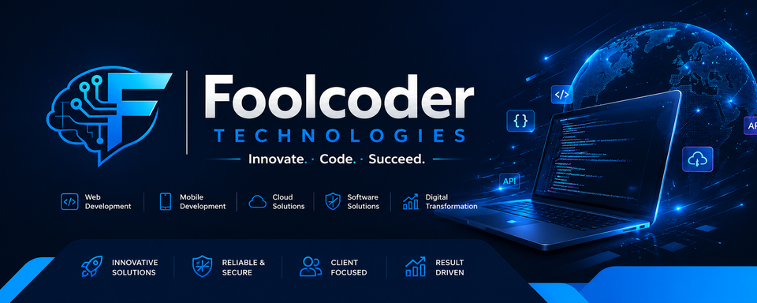

  

<h1 align="center">👋 Welcome to Foolcoder Technologies</h1>

  
  

  <b>Innovate. Code. Succeed.</b> 
  Transforming ideas into powerful digital experiences with precision and scale.

---

### 🚀 Core Expertise
We specialize in delivering high-quality, modern, and robust technology solutions tailored for business growth:

* 🌐 **Web Development:** Crafting high-performance web applications and dynamic websites.
* 📱 **Mobile Development:** Building seamless iOS and Android applications.
* ☁️ **Cloud Solutions:** Designing scalable, secure, and resilient cloud architectures.
* 🛡️ **Software Solutions:** Developing custom software systems aimed at optimizing workflows.
* 📊 **Digital Transformation:** Modernizing traditional businesses through advanced tech integration.

---

### 🛡️ Why Partner With Us?
* 🚀 **Innovative Solutions:** Staying ahead of the curve with cutting-edge technologies.
* 🔒 **Reliable & Secure:** Prioritizing code quality, security, and infrastructure reliability.
* 👥 **Client Focused:** Designing solutions around your specific needs and long-term goals.
* 📈 **Result Driven:** Maximizing ROI through efficient, scalable, and impact-driven code.

---

### 🧰 Tech Stack We Utilize
We leverage modern technologies to engineer reliable products:
* **Frontend:** React.js, Next.js, Tailwind CSS, JavaScript (ES6+), HTML5/CSS3
* **Backend:** Node.js, Express.js
* **Database:** MongoDB, PostgreSQL, MySQL
* **DevOps & Cloud:** Git, GitHub, Docker, AWS / DigitalOcean

---

### 📬 Let's Connect & Collaborate
Have an amazing project idea or want to discuss a potential partnership?
* 🌐 **Website:** *[Add your website link here]*
* 📧 **Email:** *[Add your company email here]*
* 💬 Follow us on Facebook and YouTube to stay updated with our latest open-source tools and tech tips!

---

  

  <i>⚡ Coding the future, one commit at a time. © Foolcoder Technologies</i>

